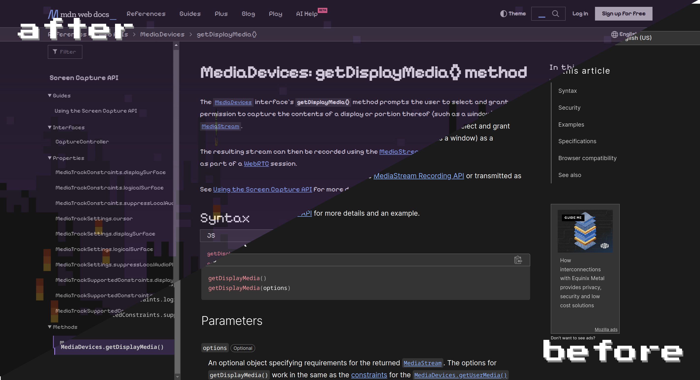

[](https://github.com/orion-tran/filter8)

# filter8

Filter what you see to 8-bit!

filter8 is a fun and nostalgic Chrome extension that transforms your web browsing experience into a delightful 8-bit-themed adventure. 
It brings a pixelated twist to your favorite websites, turning modern web content into a retro, pixel-art wonderland

With filter8, you can relive the magic of the 8-bit era while surfing the internet. 
Whether you're a gaming enthusiast, a fan of pixel art, or simply looking for a unique browsing experience, this extension will surely add nostalgia to your online activities.

## Features:
1. Transforms images with a custom 8-bit shader
2. Coverts text to 8-bit styled font (PixelifySans)
3. Easy toggle (On/Off)
4. An adjustable slider to customize how pixilized your images are

## Installation
### Webstore Installation
1. Visit the Chrome Web Store in your Chrome browser.
2. In the search bar, enter "filter8."
3. Locate the filter8 extension in the search results.
4. Click the "Add to Chrome" button.
5. Confirm the installation by clicking "Add Extension" in the pop-up window.
filter8 will be added to your Chrome browser, and you can access its features from the extension icon in the toolbar.

### Packed Installation
1. Visit the Releases of this repository.
2. Download the filter8-crx.zip file and unzip it.
3. Visit the [Chrome Extensions](chrome://extensions/) page.
4. Enable `Developer Mode`.
5. Refresh the page.
6. Drag and drop the .crx file onto the page.
7. Enable the extension.

### Local Installation
1. Clone the Repo with git or with direct download.
```
git clone https://github.com/orion-tran/filter8.git
```
2. Visit the [Chrome Extensions](chrome://extensions/) page.
3. Enable `Developer Mode`.
4. Select `Load unpacked`.
5. Select the **filter8** folder that you cloned.
6. Ensure the extension is toggled on.

## Usage
Once filter8 is installed, you can start enjoying the 8-bit themed web browsing experience. Follow these simple steps:
1. Click on the filter8 extension icon in the Chrome toolbar.
2. Press the logo to toggle on and off. The extension doesn't work on chrome:// pages (new tabs included).
3. Adjust the slider to change how pixelated images become when toggled.
4. Browse your favorite websites and watch as they transform into pixelated masterpieces.

Feedback and Support

We value your feedback and are here to assist you with any questions or issues you may encounter.
If you have suggestions for improvements or encounter any problems while using filter8, please contact us via the support channel provided on the Chrome Web Store, or make an issue on this repository!
